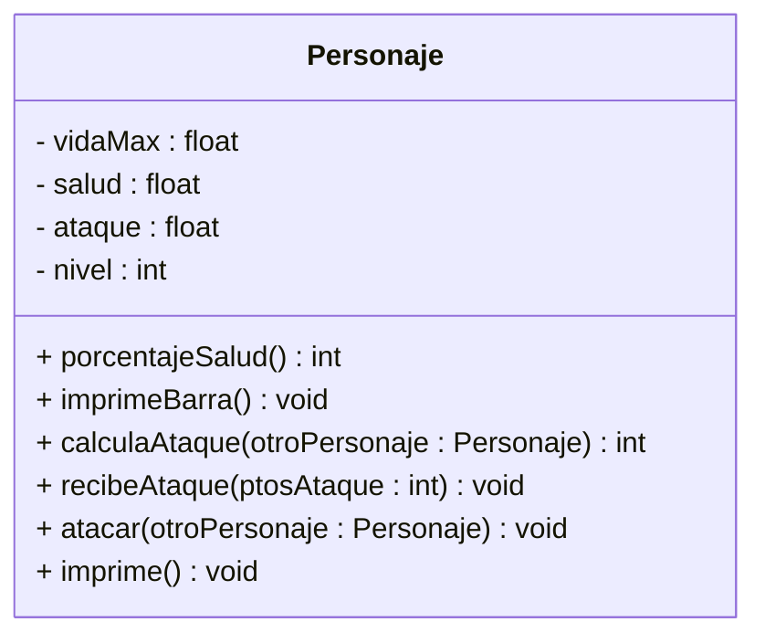

# UML

```mermaid
classDiagram
    class Personaje {
        - vidaMax : float
        - salud : float
        - ataque : float
        - nivel : int

        + porcentajeSalud() int
        + imprimeBarra() void
        + calculaAtaque(otroPersonaje : Personaje) int
        + recibeAtaque(ptosAtaque : int) void
        + atacar(otroPersonaje : Personaje) void
        + imprime() void
    }
```
